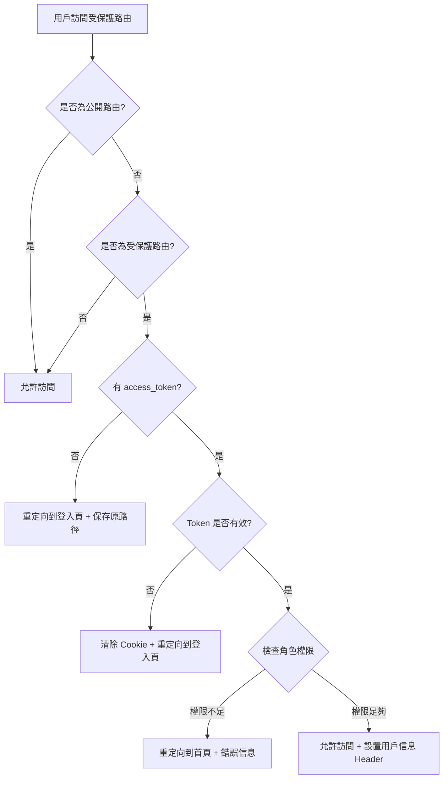
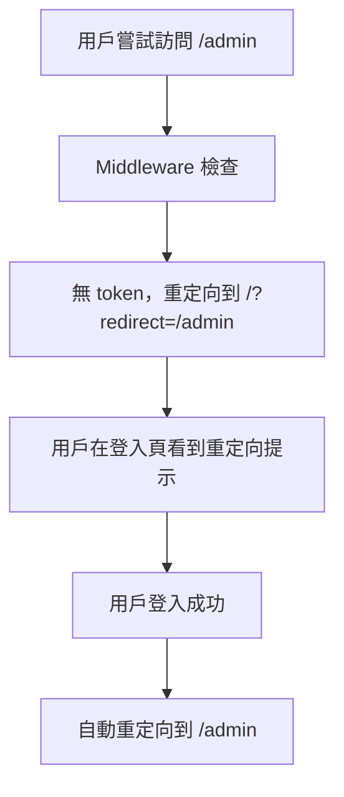

# Next.js Middleware 路由保護說明

## 概述

本項目使用 Next.js middleware 在服務器端進行路由保護，取代了客戶端的路由保護機制。這提供了更好的安全性和用戶體驗。

## 主要優勢

### 🔒 安全性提升

- **服務器端驗證**：在服務器端驗證 JWT token，防止客戶端繞過
- **提前攔截**：在請求到達頁面組件之前就進行權限檢查
- **自動清理**：無效 token 會被自動清除

### 🚀 用戶體驗改善

- **無頁面閃爍**：避免客戶端重定向造成的頁面閃爍
- **智能重定向**：登入後自動回到原本要訪問的頁面
- **錯誤提示**：清晰的權限不足提示

### 🔧 SEO 友好

- **服務器端處理**：搜索引擎不會索引到受保護的內容
- **正確的 HTTP 狀態碼**：返回適當的重定向狀態

## 路由配置

### 當前路由配置

```typescript
const routeConfig = {
  // 需要認證的路由
  protected: ['/admin', '/profile', '/dashboard'],

  // 需要特定角色的路由
  roleRequired: {
    '/admin': 'admin',
    // 可以擴展更多角色路由
    // '/manager': 'manager',
  },

  // 公開路由（不需要認證）
  public: ['/', '/login', '/register'],
};
```

### 路由類型說明

1. **公開路由** (`public`): 任何人都可以訪問
2. **受保護路由** (`protected`): 需要有效的認證 token
3. **角色限制路由** (`roleRequired`): 需要特定角色權限

## 工作流程

### 認證流程



### 登入後重定向流程



## 使用方式

### 1. 添加新的受保護路由

在 `middleware.ts` 中的 `routeConfig.protected` 數組添加路由：

```typescript
protected: ['/admin', '/profile', '/dashboard', '/new-protected-route'],
```

### 2. 添加角色限制路由

在 `routeConfig.roleRequired` 對象中添加：

```typescript
roleRequired: {
  '/admin': 'admin',
  '/manager': 'manager',  // 新增
  '/super-admin': 'super-admin',  // 新增
},
```

### 3. 檢查用戶信息

在頁面組件中，可以通過 headers 獲取用戶信息：

```typescript
// 在服務器組件中
import { headers } from 'next/headers';

export default function ProtectedPage() {
  const headersList = headers();
  const userId = headersList.get('x-user-id');
  const userRole = headersList.get('x-user-role');

  return (
    <div>
      <p>用戶ID: {userId}</p>
      <p>用戶角色: {userRole}</p>
    </div>
  );
}
```

## 測試指南

### 測試場景

1. **未登入訪問受保護路由**

   - 訪問 `/admin` 或 `/profile`
   - 應重定向到 `/?redirect=/admin` 並顯示重定向提示

2. **普通用戶訪問 admin 路由**

   - 以 `user@example.com` 登入
   - 訪問 `/admin`
   - 應重定向到 `/?error=insufficient_permissions`

3. **admin 用戶訪問**

   - 以 `test@example.com` (admin) 登入
   - 可以訪問所有受保護路由

4. **Token 過期處理**
   - 等待 token 過期（15 分鐘）
   - 訪問受保護路由
   - 應自動清除 cookie 並重定向

### 測試賬號

```javascript
// 在 src/app/api/login/route.ts 中定義
const users = [
  { id: 1, email: 'test@example.com', password: '123456', role: 'admin' },
  { id: 2, email: 'user@example.com', password: '123456', role: 'user' },
];
```

## 日誌監控

Middleware 會在控制台輸出詳細的日誌信息：

```
[Middleware] No token found for protected route: /admin
[Middleware] Insufficient role for /admin. Required: admin, User: user
[Middleware] Access granted for user 1 to /admin
[Middleware] Token verification failed for /admin: JsonWebTokenError: invalid token
```

## 擴展建議

### 1. 添加更多角色支持

```typescript
// 支持多角色檢查
const routeConfig = {
  roleRequired: {
    '/admin': ['admin', 'super-admin'],
    '/manager': ['manager', 'admin'],
  },
};
```

### 2. 基於資源的權限控制

```typescript
// 支持動態路由權限
const routeConfig = {
  resourceBased: {
    '/user/[id]': (userId: string, tokenUserId: string) =>
      userId === tokenUserId,
  },
};
```

### 3. Rate Limiting

```typescript
// 添加請求頻率限制
import { rateLimit } from './lib/rate-limit';

export function middleware(request: NextRequest) {
  // 檢查 rate limit
  if (!rateLimit(request)) {
    return NextResponse.json({ error: 'Too many requests' }, { status: 429 });
  }

  // ... 其他邏輯
}
```

## 故障排除

### 常見問題

1. **無限重定向循環**

   - 檢查 `config.matcher` 是否正確排除了 API 路由
   - 確保登入頁面在 `public` 路由列表中

2. **Token 驗證失敗**

   - 檢查 `ACCESS_TOKEN_SECRET` 環境變數
   - 確認 token 格式和簽名算法

3. **權限檢查不生效**
   - 檢查路由配置是否正確
   - 確認用戶角色是否正確設置

### 調試技巧

1. **啟用詳細日誌**

   ```typescript
   console.log('[Middleware Debug]', {
     pathname,
     hasToken: !!token,
     userRole: payload?.role,
     requiredRole,
   });
   ```

2. **檢查 Cookie**

   ```javascript
   // 在瀏覽器控制台
   document.cookie.split(';').forEach(c => console.log(c.trim()));
   ```

3. **驗證 Token**
   ```javascript
   // 在瀏覽器控制台
   fetch('/api/me', {
     headers: {
       Authorization: `Bearer ${
         document.cookie.match(/access_token=([^;]+)/)?.[1]
       }`,
     },
   })
     .then(r => r.json())
     .then(console.log);
   ```
